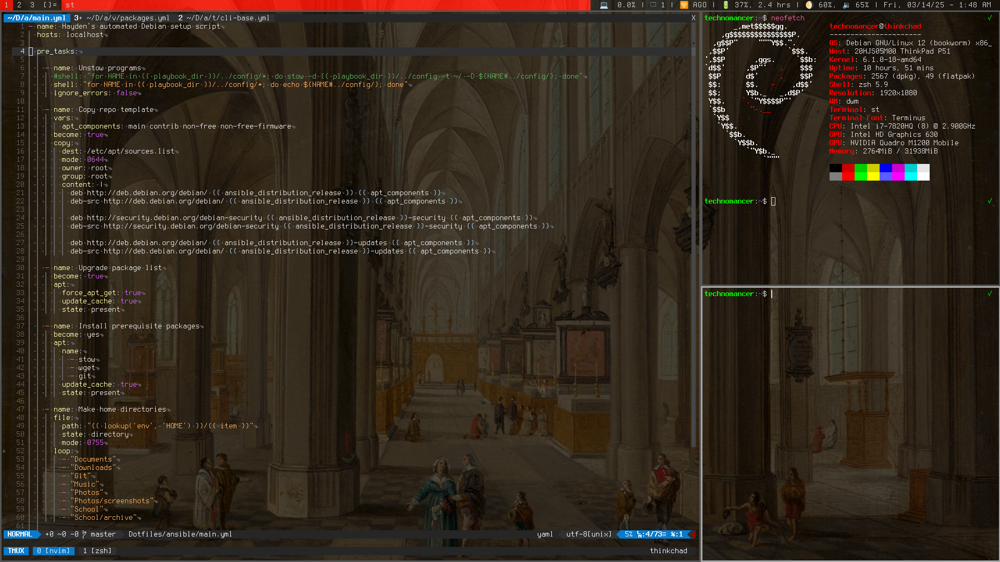

SuperAwesomeCool DWM Configuration
============================

This is my personal DWM config, which I've been using (with occasional changes) for the past couple of years. Status bar not included (dwmblocks and all my bash status bar widgets are in my [Dotfiles](https://github.com/techno-sorcery/Dotfiles) repo).

Patch List
---
- actualfullscreen - Adds keybind to make windows fill the whole screen, without any borders  
- adjacenttag - Adds keybinds to switch to adjacent tags
- alpha - Adds transparency to the status bar
- attachbottom - Causes new windows to be attached to the stack bottom
- vanitygaps - Useless gap plugin I used for a while but disabled
- cyclelayouts - Adds keybinds to cycle between enabled layouts
- hide_vacant_tags - hides... vacant tags! *gasp!*
- pertag - Layouts are now assigned per-tag, rather than being universally applied
- push_no_master - Adds keybinds to move windows within the stack
- removeborder - Doesn't draw borders if a single window is on-screen
- restartsig - Adds keybind to restart dwm
- statuspadding - Adds padding to the status bar
- swallow - Terminal windows now swallow applications launched from them
- warp - Cursor is automatically "warped" between selected windows/screens
- xresources - Adds Xresources support

Keybinds (Some are different from default)
---

 Key                        | Function 
 ---------------------------|--------------
 Alt + p                    | Open rofi       
 Alt + Shift + Enter        | Open Terminal
 Alt + b                    | Toggle status bar
 Alt + j/k                  | Focus windows
 Alt + i/d                  | Inc./dec. master window #s
 Alt + h/l                  | Horizontal resize
 Alt + Enter                | Swap master <-> stack
 Alt + Tab                  | Switch between last windows
 Alt + t                    | Tiled Layout
 Alt + v                    | Vertical Layout
 Alt + g                    | Grid Layout
 Alt + m                    | Monocle Layout
 Alt +  Ctrl + h/l          | Cycle layouts
 Alt + Shift + Space        | Toggle window floating
 Alt + ,/.                  | Cycle monitors
 Alt + Shift + ,/.          | Move window between monitors
 Alt + Shift + h/l          | Cycle between tags
 Alt + r                    | Refresh dwmblocks       
 Alt + Shift + q            | Restart DWM
 Alt + Shift + Ctrl + q     | Kill DWM

 Macros
 ---

 Key                        | Function 
 ---------------------------|--------------
PrtSc                       | Screenshot with scrot
Win + c                     | Open orpie calculator       
Win + m                     | Open ncmpcpp music player
Win + n                     | Open newsboat reader
Win + b                     | Open Vivaldi browser
Win + s                     | Open signal messenger
